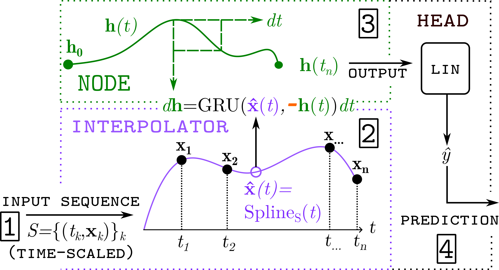
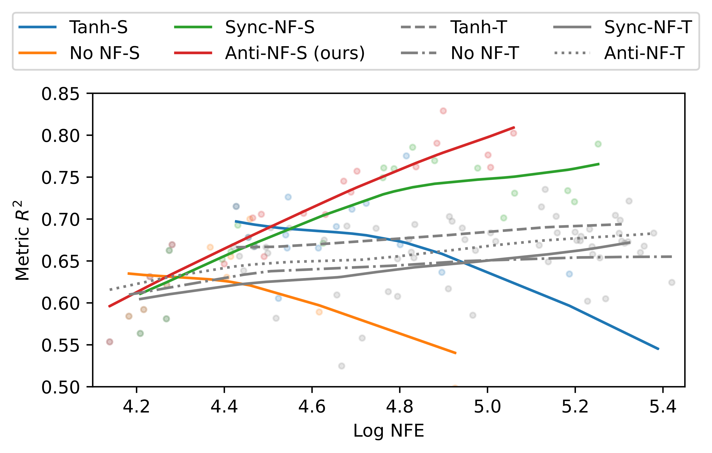

<h1 align='center'> DeNOTS: Stable Deep Neural ODEs for Time Series. <br>
(
    ICLR 2026 Poster, 
    <a href="https://arxiv.org/abs/2408.08055">arXiv</a>
)
<br>
</h1>

DeNOTS is a novel theoretical and practical framework for Neural CDEs that:

* increases expressiveness by extending the integration horizon,
* introduces antisynchronous Negative Feedback for stable long-time dynamics,
* provides theoretical guarantees on uncertainty and discretization error, and
* achieves up to 20% performance gains over strong baselines.



No additional libraries are required to train these models, the classic torchdiffeq or the torchode are enough. 
The trick lies in the correct time scale and a stable-yet-flexible vector field, which in conjunction achieve significant performance gains.

### Theory
Our theoretical analysis considers all aspects of the proposed method; it includes:

* Characterizing the class of mappings that Neural CDEs can approximate, with Lipschitz constants determined by the vector field constraints and the integration time scale.
* Proving that the Negative Feedback form of the vector field is input-to-state stable, ensuring stability in the presence of input signals.
* Establishing theoretical bounds on the accumulation of integration and interpolation errors for the proposed vector field.


### Experiments
Our main experiments show that increasing time scale reliably increases the prediction quality with our Anti-NF-based vector field.
Below is an image, demonstrating precisely that on the synthetic Pendulum dataset:



A more in-depth guide on how our repository is structured, and on how to reproduce our experiments can be found in [repository.md](repository.md).

### Citation
```
@inproceedings{
kuleshov2026denots,
title={{DeNOTS}: Stable Deep Neural {ODE}s for Time Series},
author={Ilya Kuleshov and Evgenia Romanenkova and Vladislav Andreevich Zhuzhel and Galina Boeva and Evgeni Vorsin and Alexey Zaytsev},
booktitle={The Fourteenth International Conference on Learning Representations},
year={2026},
url={https://openreview.net/forum?id=SFoDJZ1sSk}
}
```
